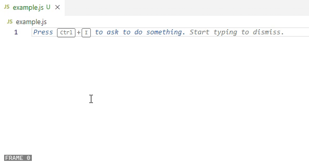

## About

Disables the creation of a new comment line when pressing the `Enter` key in the middle of an existing comment line in JavaScript and TypeScript files.

### JavaScript

> `C:\Program Files\Microsoft VS Code\resources\app\extensions\javascript\javascript-language-configuration.json`

This line is responsible for creating the new comment line in JavaScript files.

```json
{
  ...
  "onEnterRules": [
    ...
    { "beforeText": { "pattern": "//.*" }, "afterText": { "pattern": "^(?!\\s*$).+" }, "action": { "indent": "none", "appendText": "// " } }
  ]
}
```

### TypeScript

> `C:\Program Files\Microsoft VS Code\resources\app\extensions\typescript-basics\language-configuration.json`

Same deal with TypeScript.

```json
{
  ...
  "onEnterRules": [
    ...
    { "beforeText": { "pattern": "//.*" }, "afterText": { "pattern": "^(?!\\s*$).+" }, "action": { "indent": "none", "appendText": "// " } }
  ]
}
```

### Demonstration



Please read the `README.md` file at https://github.com/ericchase-library/ts-library for more information.

## Developer Environment Setup

I generally recommend VSCode for web development.

**Install the Bun runtime**

- https://bun.sh/

**Install npm dependencies**

```
bun install
```

**Build the project**

For continuous building as you work:

```
bun run dev
```

For final builds:

```
bun run build
```

**Run the Biome linter**

```
bun run lint
```
